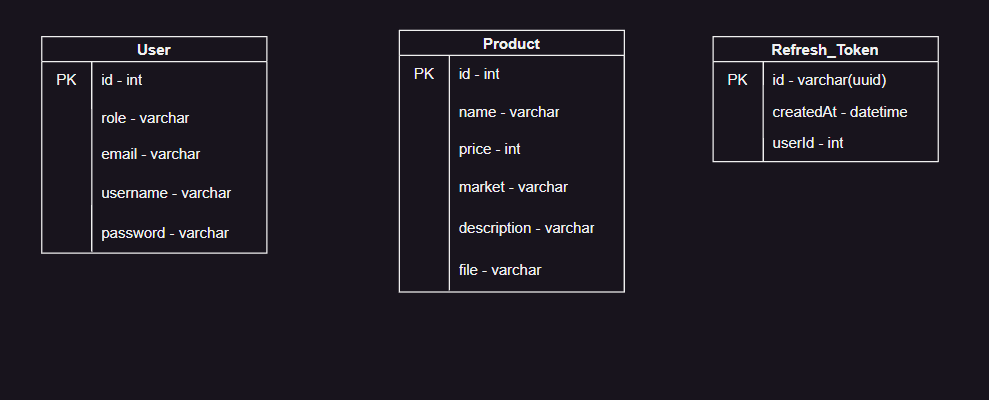

# Getting Started with the "Yatsa-Shop" server

## Step 1

In the project directory run:

### `npm install`

This command will install all the needed dependencies to the server.

## Step 2

This project uses postgresql database to store data.\
Now you need to tell the server the database data that points to your own database.

Database configuration is stored inside `src/config/configuration.ts`
You can override configuration parameters by passing them via ENV variables or by locally modifind default variables
Default config parameters:

```javascript
DB_HOST = 'localhost';
DB_USERNAME = 'admin';
DB_PASSWORD = 'admin';
DB_DATABASE = 'shop_back';
DB_PORT = 3306;
JWT_SECRET = 'secret';
JWT_EXPIRES_IN = 3600;
```

## Step 3

First, make sure you have mysql on your local machine.\

### Run in order to create `shop_back` database it it doesn't exist,

For create new data base I using utils MySQL Workbench

`"CREATE DATABASE shop_back"`

## Step 4

Now your server is good to go.

Run this command in the project directory to start:

### `npm start`

You server runs on [http://localhost:3000](http://localhost:3000)

## Also "yatsa-shop" hosted on Google Cloud Platform [https://yatsa-shop-back-fk6pcl23iq-uc.a.run.app](https://yatsa-shop-back-fk6pcl23iq-uc.a.run.app)

## About Admin Permissions

### It need to do for create products on Yatsa-Shop

```
1. For login to Yatsa-Shop using username=admin, password=admin or if server run local, you need to change one created user role to 'admin'.
2.With this permissions you can create/delete some products for testing application.
```

## Database schema



## In Repository or `https://yatsa-shop-back-fk6pcl23iq-uc.a.run.app/docs` availability OpenAPI Specification
